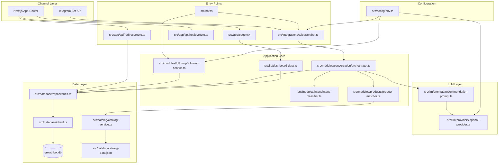
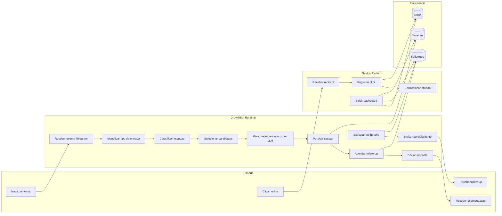

# GrowthBot DE Architecture Diagrams

## 1. Operational Flow

```mermaid
flowchart TD
    A[Usuario envia mensagem no Telegram] --> B[Telegram Bot API]
    B --> C[src/integrations/telegram/bot.ts]
    C --> D{Tipo de entrada}

    D -->|/start| E[clearSession user]
    E --> F[Envia mensagem de boas-vindas com nichos]

    D -->|/restart| G[clearSession user]
    G --> H[Confirma reinicio]

    D -->|callback de nicho| I[Mapeia callback para mensagem base]
    I --> J[chat userId userMessage]

    D -->|mensagem livre| J

    J --> K[getSessionHistory]
    K --> L[classifyIntent]
    L --> M[matchProducts]
    M --> N[getAllProducts catalogo]
    N --> O[buildRecommendationPrompt]
    O --> P[generateStructuredRecommendation]
    P --> Q[OpenAI Chat Completions]
    Q --> R[Seleciona produto final]
    R --> S[saveSessionHistory]
    S --> T[upsertFollowUp 24h]
    T --> U[sendMessage resposta]

    V[src/bot.ts scheduler] --> W[runFollowUpJob]
    W --> X[getPendingFollowUps]
    X --> Y[Constroi tracked link]
    Y --> Z[Envia follow-up no Telegram]
    Z --> AA[markFollowUpSent]

    AB[Usuario clica no link] --> AC[/api/redirect]
    AC --> AD[registerClick]
    AD --> AE[SQLite]
    AC --> AF[302 redirect para afiliado]
```

## 2. Layered Architecture



## 3. BPMN-Style Business Flow



## Notes

- O fluxo conversacional principal entra sempre pelo adapter do Telegram.
- O orchestrator concentra a regra de aplicação e delega intenção, catálogo, prompt, LLM e persistência.
- O dashboard não participa da conversa; ele é apenas uma superfície operacional sobre o SQLite.
- O tracking de afiliado acontece só no redirect HTTP, não dentro da resposta do bot diretamente.
